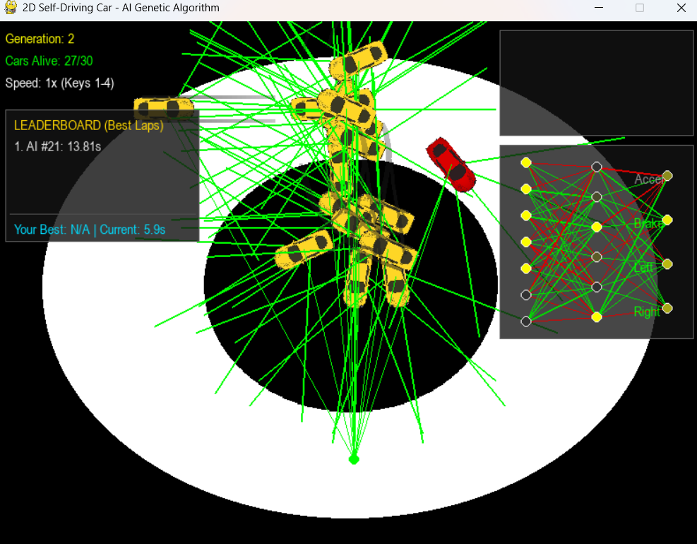
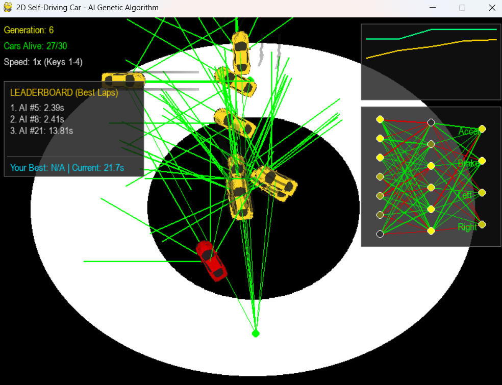
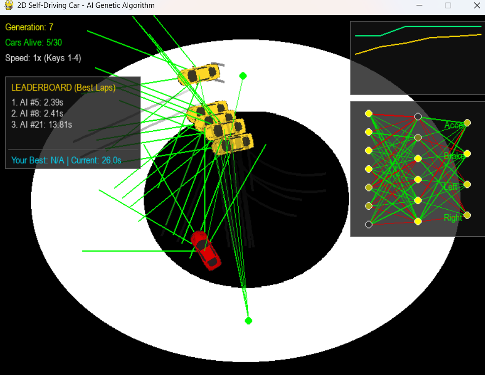

# 🏎️ 2D Self-Driving Car with Genetic Algorithm

A 2D autonomous car simulation built in Python using Pygame. The AI learns to navigate custom tracks through evolutionary computation (Genetic Algorithms) and neural networks. Features a built-in checkpoint track editor, real-time neural visualizers, and a human-driven mode.

---

## 🛠️ Features

* **Interactive Track Editor:** Draw and save custom checkpoint paths in real time.
* **Genetic Algorithm Engine:** Evolves car neural network weights over generations based on track progression and survival.
* **Telemetry & Visualizations:** Real-time neural network layer activation and fitness graph visualizers.
* **Multiple Speed Multipliers:** Fast-forward training up to 100x speed.
* **Human Mode:** Drive against the AI population to test your lap times.

---

## 🚀 Getting Started

### Prerequisites

Ensure you have Python 3.8+ installed on your system.

### Installation

1. **Clone the repository:**
   ```bash
   git clone [https://github.com/im-jola/ApexAI.git](https://github.com/im-jola/ApexAI.git)
   cd ApexAI

## 📸 Screenshots

### Track Editor


### Real-Time Simulation


### Telemetry & Neural Network Visualizer

